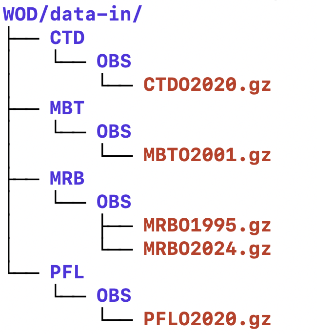
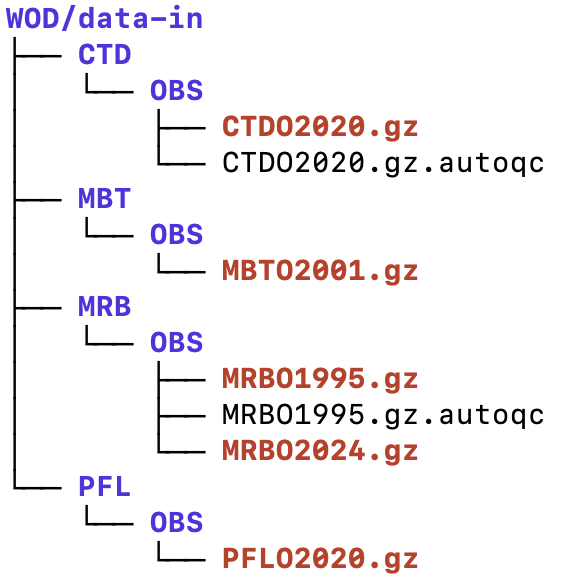
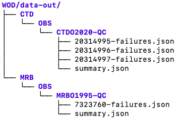

# Introduction
The auto-qc-pipline allows for synchronous processing of World Ocean Database (WOD) data. 

# Setting up the Python Environment

## MacOS
  1. Install pyenv (https://github.com/pyenv/pyenv#set-up-your-shell-environment-for-pyenv)
     1. ```brew update```
     2. ```brew install pyenv```
     3. In ~/.bashrc add
        1. ```export PYENV_ROOT="$HOME/.pyenv"```
        2. ```export PATH="$PYENV_ROOT/bin:$PATH"```
        3. ```eval "$(pyenv init -)"```
     4. ```brew install openssl readline sqlite3 xz zlib tcl-tk```
  2. Install pyenv-virtualenv (https://github.com/pyenv/pyenv-virtualenv)
     1. ```brew install pyenv-virtualenv```
     2. In ~/.bashrc add
         1. ```eval "$(pyenv virtualenv-init -)"```
  3. Open a new terminal
  4. Install Python version
     1. ```env PYTHON_CONFIGURE_OPTS="--enable-shared" pyenv install 3.9.2```
     2. Optional: set global version of Python ```env PYTHON_CONFIGURE_OPTS="--enable-shared" pyenv global 3.9.2```
  5. Create virtual env
     1. ```pyenv virtualenv 3.9.2 auto-qc-pipeline-1.0.0-SNAPSHOT```
  6. Set local version of python (if not done already)
     1. change directory to root of project
     2. ```pyenv local auto-qc-pipeline-1.0.0-SNAPSHOT```
     

## Installing Dependencies

  1. Add dependencies with versions<br>
     ```pip install --upgrade pip && pip install -r requirements-dev.txt```
     1. Setting up AutoQC 
        1. Clone AutoQC from github at https://github.com/IQuOD/AutoQC
           1. Directions for cloning are located in the AutoQC README.md file
           2. Checkout the remote branch: auto-qc-pipeline
           ```
           $ git fetch
           $ git checkout auto-qc-pipeline
           ```
        2. Set the environment variable AUTOC_QC_HOME to AutoQC
           ```
           export AUTO_QC_HOME=/Users/WOD/AutoQC
           ```
        3. Run the script setup-ec2.sh to download the World Ocean Atlas netcdf files. 
        The files will be downloaded to /Users/WOD/AutoQC/data
           ```
           ./setup-ec2.sh
           ```

# Execution of auto-qc-pipeline
1. Make a directory for WOD-ASCII data to be processed. 
This directory will be referred to as /Users/WOD/data-in<br>
   
2. change directory to auto-qc-pipeline
    ```
    cd /Users/WOD/auto-qc-pipeline
    ```
3. Update run-auto-qc-pipeline.sh with your configuration settings
   1. /Users/WOD/AutoQC - path to AutoQC <br />
   2. /Users/WOD/auto-qc-pipeline - path to auto-qc-pipeline<br />
   3. /Users/WOD/data-in -  contains the WOD-ASCII data to be processed.<br />
   4. /Users/WOD/data-tmp - temp directory for processing <br />
   5. /Users/WOD/data-out - output directory for summary and failure files
   6. IQUOD
      1. True - runs tests that relate to IQUOD flag
      2. False - runs all tests

     ```
    export AUTO_QC_PIPELINE_ROOT=/Users/WOD/auto-qc-pipeline
    export PYTHONPATH="$AUTO_QC_PIPELINE_ROOT/src:$AUTO_QC_HOME"
    export PYTHONUNBUFFERED=1
    export WOD_GZ_DATA=/Users/WOD/data-in
    export WOD_UNGZ_DATA=/Users/WOD/data-tmp
    export AUTO_QC_OUTPUT=/Users/WOD/data-out
    export AUTO_QC_PIPELINE_UNZIP_CONCUR=3
    export AUTO_QC_PIPELINE_TEST_CONCUR=4
    export RUN_ONLY_IQUOD=True
    export AUTO_QC_LOGGING_YAML="$AUTO_QC_PIPELINE_ROOT/test-resources/logging.yaml"
    ```
4. Run run-auto-qc-pipeline.sh
    ```
   ./run-auto-qc-pipeline.sh
   ```
# Initializing Job
auto-qc-pipline allows for synchronous processing of multiple WOD-ASCII data. 
To trigger processing of a WOD-ASCII data file, create a file with the same name.gz.autoqc.
In this example, CTD2020.gz and MRB01995.gz will be synchronously processed. 
There is no limit to how many files can be processed.


# Output
The output files (summary.json and failure.json) for the processed WOD-ASCII data 
will be stored in /Users/WOD/data-out<br>



